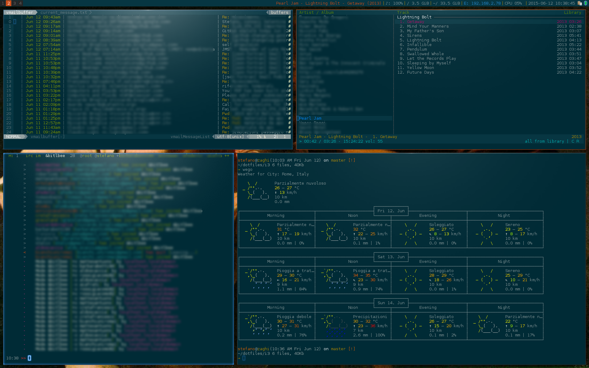
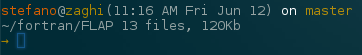
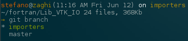

<a name="top"></a>

# szaghi's dotfiles

[](https://gitter.im/szaghi/dotfiles?utm_source=badge&utm_medium=badge&utm_campaign=pr-badge&utm_content=badge)

> *dotfiles* are your virtual home... this is my home

|App          | My choice                                                      |
|-------------|----------------------------------------------------------------|
|os           | [Arch Linux](www.archlinux.org)                                |
|wm           | [i3-gaps](https://github.com/Airblader/i3)                     |
|shell        | [bash]( http://www.gnu.org/software/bash)                      |
|terminal     | [terminlogy](https://www.enlightenment.org/about-terminology)  |
|editor       | [vim](http://www.vim.org)                                      |
|music player | [cmus](https://cmus.github.io)                                 |
|theme        | [solarized (everywhere)](http://ethanschoonover.com/solarized) |

> A dotfiles repository is not intended to be forked, commonly it is a backup, this is my home not your...

> However, my settings can inspire yours and viceversa, sharing our configs is great!

## What?

##### This repository is

+ a place where to backup my personal configuration files;
+ a place for sharing my idea;
+ a place where I hope others can inspire me.



For my *buggy* memory and for your *inspiration*, in the following I give some details about my dotfiles.

> Your help is very appreciated: share with me your dotfiles (and idea), **open an issue** in this repository!

## Table of contents

- [Bootstrap](#bootstrap)
- [dotfiles Tree](#dotfiles-tree)
  - [i3](#i3)
  - [bash](#bash)
  - [vim](#vim)
- [Copyrights](#copyrights)

## Bootstrap

> you are your dotfiles, this is me... you should **not** bootstrap from here!

> ok, you are advised, follow this bootstrap can **destroy** your home!

During my *pernigration* into the web I found [dotbot](https://github.com/anishathalye/dotbot), that is (in short) a smart tool for managing dotfiles.

My managing approach is:

+ store dotfiles into one directory (I named *dotfiles* but it does not matter) thus that I can:
  + easy version control dotfiles by means of git;
  + keep clean the repository:
    + exploit a tree organization based on nested directory;
  + easy bootstrapping for fresh installation;
+ my home must contain only *sym links* to the actual dotfiles:
  + dotbot do this job for me greatly.

Bootstrapping is very simple:

##### Bootstrapping
```shell
git clone https://github.com/szaghi/dotfiles your-dotfiles
cd your-dotfiles
./install
```
No matter you call your dotfiles root directory: dotbot (`install` is its wrapper) will create symbolic links from your dotfiles root directory into your home (but not just this: it will check for previous invalid sym links, cleaning your home if necessary).

The *automagical* bootstrap is done by the [install.conf.yaml](https://github.com/szaghi/dotfiles/blob/master/install.conf.yaml) dotfile where (in a very simple syntax) are defined which (and how) configuration files (and directories) must be symbolically linked into your home.

For example, the **vim** bootstrapping is done by (extracted from my [install.conf.yaml](https://github.com/szaghi/dotfiles/blob/master/install.conf.yaml)):

```yaml
- link:
    ~/.vim:
      path: vim/
      relink: true
      force: true

    ~/.vimrc:
      path: vim/vimrc
      relink: true
      force: true
```

For more details see dotbot [documentation](https://github.com/anishathalye/dotbot).

Go to [Top](#top) or [TOC](#table-of-contents)

## Dotfiles Tree

Presently my tree organization is the following:

+ **bash**: contains my shell (bash obviously) settings, aliases, exports, ecc...;
+ **dotbot**: is the git submodule repository containing the dotbot bootstrapper;
+ **encrypt**: is where I place my encrypted files... stay away;
+ **git**: contains git configurations;
+ **i3**: contains i3 wm configurations and scripts;
+ **icons**: contains my preferred (mouse) icons;
+ **miscellanea**: contains dotfiles for various stuff that do not necessity more than one config file thus that do not need a dedicated directory;
+ **terminal**: contains configurations (IO and colors) for the terminal;
+ **vim**: no explanation is necessary... vim rocks!

I will not give you details about each of them. In the following there are some screenshots of my dotfiles application result.

### i3

[i3-gaps](https://github.com/Airblader/i3) is **great**, but it has a big cons... it creates addiction, be careful!

I do not use the main branch of i3: I prefer to have a small gap between each window: my settings refers to the [i3-gaps](https://github.com/Airblader/i3) fork.


The status bar is slightly hacked for showing the title of the window currently active.

### Bash

I use a 2-lines bash prompt providing many useful informations.

##### Prompt



In particular, when dealing with git repositories, my prompt is like the *liquid* one (google it for more details) providing contextual informations about the current status of the repository where you are.

##### Git branches



##### Git status


### Vim

To be written.

Go to [Top](#top) or [TOC](#table-of-contents)

## Copyrights

My dotfiles come from a long time usage of GNU/Linux boxes. I take inspiration from a lot of people sharing their dotfiles into the web, I cannot precisely say from where and who. Anyhow, my dotfiles are distributed under the terms of [*WTFPL, Do What the Fuck You Want to*](http://www.wtfpl.net/) Public License without any warranty.

Go to [Top](#top) or [TOC](#table-of-contents)
