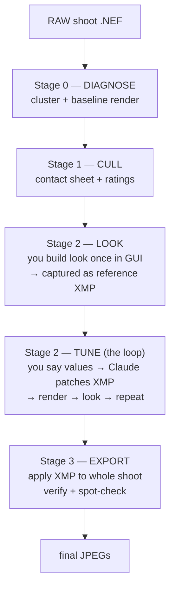

# darktable-operator — User Guide

How to use Claude as your RAW post-processing assistant: **you direct, Claude
operates.** You build a base *look* once in the darktable GUI; from then on you
describe adjustments in plain language ("darken the window, soften the
contrast") and Claude patches the edit, re-renders, and shows you the result —
iterating until you approve, then batch-exporting the shoot.

> This guide is the how-to. For darktable module/parameter knowledge see the
> companion **`darktable-raw`** skill. For the exact verified byte-offsets
> behind the promptable values see **`VERIFIED-OFFSETS.md`** in this folder.

---

## 1. The mental model



**Why it works this way.** darktable edits are stored in an XMP sidecar as
packed module parameters. Claude cannot *invent* an artistic look from nothing
(that is your taste, dragged once in the GUI) — but it *can* set precise
parameter **values** by patching the XMP, and apply them headlessly with
`darktable-cli`. So: **you own the look's shape; Claude owns the values, the
batching, and the QA.**

---

## 2. The promptable levers

Everything below is empirically verified (render-proven). Say it in plain
language; Claude maps it to a field patch.

| You say… | Module · field | Direction |
|---|---|---|
| "brighter / darker faces" | `exposure` (auto target, or manual EV) | up = brighter |
| "match brightness across the series" | `exposure` auto mode | one XMP, per-frame auto |
| "recover highlights" / "protect the whites" | `filmicrgb.white_point` | **lower = more recovery** |
| "deeper blacks" / "lift the shadows" | `filmicrgb.black_point` | lower = deeper |
| "more punch" / "soften the contrast" | `filmicrgb.contrast` | up = punchier, <1 = softer |
| "more / less saturated" | `colorbalancergb.saturation` | fraction 0–1 |
| "darken the window / sky / bright background" | `toneequal` bright bands (`speculars`, `whites`, `highlights`) | negative EV |
| "lift just the shadows locally" | `toneequal` dark bands (`noise`, `deep_blacks`, `blacks`) | positive EV |

**Not yet promptable** (would need a mapping session — see §7): hue shift,
crop/straighten.

---

## 3. The four-stage pipeline (commands)

All commands: `bash ~/.claude/skills/darktable-operator/scripts/dt-batch.sh <cmd> …`
In practice you never type these — you talk to Claude and it runs them. They
are documented so the workflow is auditable.

### Stage 0 — Diagnose
```bash
dt-batch.sh diagnose <raw_dir> [out_dir]
```
Clusters the shoot by camera·ISO·exposure-program and renders one neutral
baseline per cluster. Claude **reads** the baselines and writes an
image-derived diagnosis (exposure, clipped highlights, WB cast, geometry,
noise) per cluster.

### Stage 1 — Cull
```bash
dt-batch.sh contact <raw_dir> [out_dir] [cols] [thumb_px]
```
Renders labelled contact-sheet pages. Claude proposes keep/reject + star
ratings; **you ratify** (expression and "whom to favour" are yours). Rejects
skip all further work.

### Stage 2 — Look (build once) + Tune (the loop)
```bash
# ONE-TIME: capture a GUI-built style as an editable XMP (GUI must be CLOSED)
dt-batch.sh ref <ref.NEF> <style_name> <out.xmp>

# THE LOOP: patch a value, render, look
dt-xmp-patch.py <xmp> set <module> <field> <value>
dt-batch.sh render <ref.NEF> /tmp/qa.jpg 1600 <xmp>
```
You build the look's *shape* in the GUI once (exposure → filmic → colour
balance; save as a style). Claude captures it (`ref`), then drives values via
`dt-xmp-patch.py` and re-renders until you approve.

### Stage 3 — Export
```bash
dt-batch.sh apply <raw_dir> <out_dir> <ref.xmp> [width] [quality] [overrides.tsv]
```
Applies the tuned XMP to every RAW (positional-XMP path — GUI-safe), then
verifies count + a visual spot-check. `width 0` = full resolution.

---

## 4. Reading / setting values directly

```bash
# inspect
dt-xmp-patch.py look.xmp list                       # which modules are patchable
dt-xmp-patch.py look.xmp get filmicrgb              # all filmic fields
dt-xmp-patch.py look.xmp get toneequal speculars    # one field

# set
dt-xmp-patch.py look.xmp set filmicrgb white_point 2.6
dt-xmp-patch.py look.xmp set toneequal speculars -2.0
```
Values are written in **native units**: exposure/filmic in EV, tone-equalizer
bands in EV, colour-balance saturation as a **fraction** (0.30 = 30 %).

---

## 5. Per-frame overrides (a series with one look)

One look fits the series; individual frames sometimes need a nudge (e.g. a
darker-shot frame). Put exceptions in a TSV and pass it to `apply`:

```
# overrides.tsv  —  <basename-regex>\t<module>\t<field>\t<value>
DSC_5004	exposure	exposure	1.15
DSC_50(0[6-9]|1[0-2])	filmicrgb	white_point	2.4
```
`apply` copies the base XMP per matching frame, patches the listed fields, and
renders — no hand-made per-frame XMPs.

---

## 6. Worked example — the prompt this guide was built around

> *"darken the window, recover highlights in faces, soften the contrast"*

Claude's translation and execution:
```bash
cp look-auto.xmp look-prompt.xmp
# (look-auto has no tone-equalizer → inject a default block first)
dt-xmp-inject.py look-prompt.xmp <seed-with-toneequal>.dtstyle toneequal

dt-xmp-patch.py look-prompt.xmp set toneequal speculars  -2.0   # darken window
dt-xmp-patch.py look-prompt.xmp set toneequal whites     -1.5
dt-xmp-patch.py look-prompt.xmp set toneequal highlights -0.7
dt-xmp-patch.py look-prompt.xmp set filmicrgb white_point 2.6    # recover highlights
dt-xmp-patch.py look-prompt.xmp set filmicrgb contrast    0.8    # soften
dt-batch.sh render raw/DSC_5004.NEF final-prompt/DSC_5004.jpg 0 look-prompt.xmp
```
Result: bright background recovered, faces open, gentler tone — verified by
looking, at full resolution.

---

## 7. Extending the promptable levers (mapping session)

To make a new field promptable, map its byte offset **empirically** — never
guess (guessing silently corrupts edits):

1. In the GUI, change **one** named slider to an unmistakable value; save as a
   throwaway style `diffN`.
2. Claude diffs the `.dtstyle` bytes against a baseline; the word that moved to
   your value **is** that field. (Diff the `.dtstyle` directly — a
   CLI-regenerated XMP drops edits.)
3. Confirm by rendering a patched value; add the verified offset to
   `dt-xmp-patch.py`'s `FIELDS` map and to `VERIFIED-OFFSETS.md`.

This is how exposure, filmic (white/black/contrast), colour-balance saturation,
and the tone-equalizer's 9 bands were mapped.

---

## 8. Gotchas (hard-won — do not rediscover)

- **Stray `<raw>.NEF.xmp` sidecars next to the raws contaminate `apply`** — they
  merge into the applied history. `apply` refuses to run if any exist; remove
  them (`rm raw/*.NEF.xmp`) first.
- **`ref` needs the GUI CLOSED** (darktable locks `data.db`/`library.db`). Every
  other command uses an isolated/`:memory:` library and is GUI-safe.
- **OpenCL is absent on WSL** — a render dying at ~0.4 s with
  `imageio_storage_disk: could not export` is the OpenCL/storage path; the
  helpers' CPU path works. (Add `--disable-opencl` to a bare invocation.)
- **darktable-cli silently drops `colorbalancergb` and never emits
  `toneequal` from a style.** Use `dt-xmp-inject.py` to splice the module's
  block into the XMP as an `rdf:li` before patching it.
- **filmic `contrast` couples a derived spline word** in the GUI; a static patch
  sets contrast alone (fine — darktable recomputes the spline on apply).
- **Tone-equalizer slider order = struct order = darkest→brightest.** `noise` is
  the darkest band, `speculars` the brightest. Verified: a GUI −2.0 on the
  leftmost slider landed in `noise`.
- **Always judge by looking.** No result is "done" until the rendered JPEG has
  been viewed. Claude will not claim an outcome it has not seen.

---

## 9. File inventory (helper scripts)

| File | Role |
|---|---|
| `scripts/dt-batch.sh` | pipeline driver: `diagnose · contact · ref · render · apply · verify` |
| `scripts/dt-xmp-patch.py` | get/set verified module param values in an XMP |
| `scripts/dt-xmp-inject.py` | splice a dropped module (colorbalancergb, toneequal) into an XMP |
| `VERIFIED-OFFSETS.md` | the empirically-mapped struct offsets (authoritative) |
| `SKILL.md` | the operator playbook Claude loads |

For module semantics (what filmic *does*, why scene-referred, etc.), read the
**`darktable-raw`** skill.
